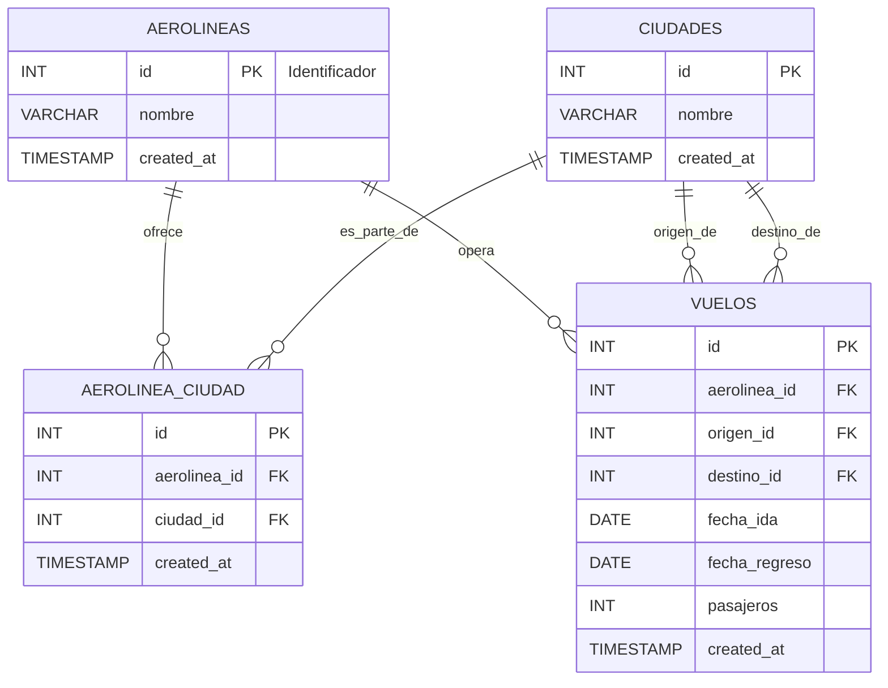

Diagrama Entidad-Relación (ER)

A continuación se presenta el diagrama ER en formato Mermaid (puede renderizarse en visores compatibles):

Entidades:
- `aerolineas`
- `ciudades`
- `aerolinea_ciudad` (tabla intermedia)
- `vuelos`

Relaciones y cardinalidades:
- Una aerolínea puede ofrecer muchas ciudades (vía `aerolinea_ciudad`): 1..* (aerolineas) a 0..* (aerolinea_ciudad).
- Una ciudad puede pertenecer a muchas aerolíneas (muchos a muchos mediante `aerolinea_ciudad`).
- Un vuelo está asociado a una aerolínea y dos ciudades (origen y destino).
